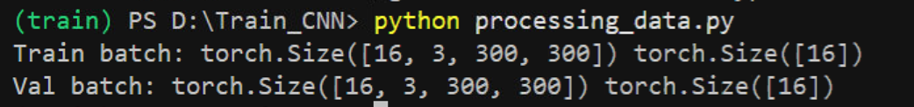
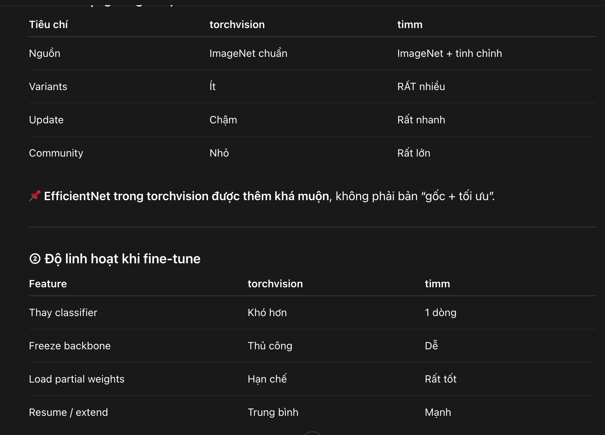

# Create mtr ảo
    - python -m venv <ten>  
    - Set-ExecutionPolicy -Scope Process -ExecutionPolicy Bypass
    - .\<ten>\Scripts\activate
# Pipeline chuẩn train efficientnet-b3 (300 × 300 × 3)

## Load ảnh
        - Resize + Normalizes
        - Augment train
        - Batch loader
        - Freeze backbone
        - Train head
        - Unfreeze 1–2 block
        - Fine-tune
        - Monitor val loss/acc
        - Save best model
        - Test & compute confusion matrix

## Handle dataset 
    - Ảnh gốc
        - kiểm tra RGB
        - chia folder theo class
        - chia train / val / test
        - resize 300×300
        - normalize ImageNet
        - augment (chỉ train) -> lá chụp không có nhiều gốc như trong thực tế, nên cần Augmentation mạnh về độ sáng và độ tương phản
        - đưa vào model

## Train 
for epoch:
    model.train()
        forward
        loss
        backward
        optimizer.step()

    model.eval()
        forward (no grad)
        val loss / acc

    save checkpoint

## Tư duy

- Dùng pretrained ImageNet

- Thay classifier cuối theo số class dataset

- Giai đoạn đầu: freeze backbone

## Run
- chạy từ đầu:
    processing_data.py
    eff_train.py
    eff_val.py
    Checkpoint.py
    resume.py
    train.py
- resume lại:
- test
    handle_test.py
    load_model_test.py
    test.py

## Datasets
Link: https://drive.google.com/file/d/1woZmhlRF15m5CEuNAV2G8XrJfxODF1t1/view?usp=sharing

## Best và last
Link: https://drive.google.com/drive/folders/1KATCF0xNO-Sim13-3h745TCt-NXUE0Lv?usp=sharing
